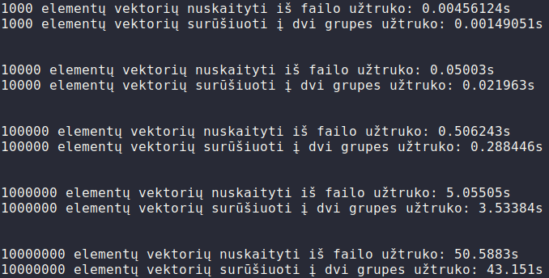
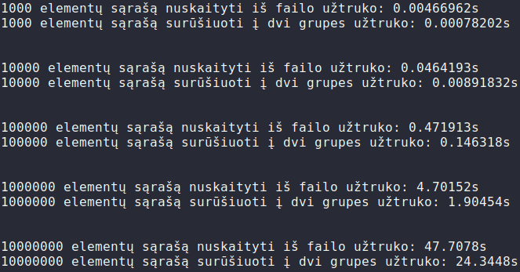
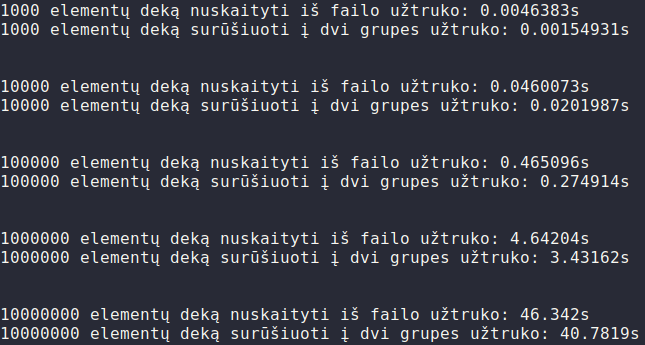

# OP_2

Programa surenka studentų vardus su pavardėm bei namų darbų ir egzamino rezultatus.
Yra galimybė sugeneruoti pažymius automatiškai ir pasirinkti ar norėtumėte apskaičiuoti vidurkį ar medianą.
Po įvedimo išveda visus studentus kurie gavo pažymių lentelėje su vidurkiais/medianom.

## Kaip paleisti

 - `git clone git@github.com:kuwanaba/OP_2.git`
 - `cd OP_2`
 - `make`
 - `./bin/main`
 
 
## Changelog
 
 ---
 
## [v0.1_arrays](https://github.com/kuwanaba/OP_2/tree/v0.1_arrays) (04/03/2021)
 - Implementuota naudojant dinaminius C masyvus
## [v0.1_vectors](https://github.com/kuwanaba/OP_2/tree/v0.1_vectors) (04/03/2021)
 - Implementuota naudojant vektorius
## [v0.2](https://github.com/kuwanaba/OP_2/tree/v0.2) (06/03/2021)
 - Pridėta galimybė nuskaityti studentus iš failo
 - Outpute studentai yra surikiuojami pagal pavardes
## [v0.3](https://github.com/kuwanaba/OP_2/tree/v0.3) (06/03/2021)
 - Pridėtas exception'ų checkinimas atidarinėjant failą
 - Kodas jau buvo splittintas į headerį, metodų source'ą ir main source failą
 - Kode jau buvo naudojamos struktūros
## [v0.4](https://github.com/kuwanaba/OP_2/tree/v0.4) (01/04/2021)
 - Pridėta galimybė sugeneruot studentų failus atsitiktinai
 - Programa sugeneruoja 1000, 10000, 100000, 1000000, 10000000 studentų atskirai
 - Išveda kiek laiko truko sukurt failą, įrašyt/nuskaityt duomenis į failą, surušiuot bei išvest į du skirtingus failus pagal pažymius

## [v0.5](https://github.com/kuwanaba/OP_2/tree/v0.5) (03/04/2021)
 - Kodas pertvarkytas, naudotojui suteiktas meniu su galimybe rinktis tolimesnius veiksmus
 - Pridėta galimybė sugeneruoti didelių apimčių sarašus/vektorius/dekus ir išmatuoti jų nuskaitymo iš failų bei grupavimo į dalis greičius
 - Pridėtas makefile'as leidžiantis paprasčiau sukompiliuoti reikalingus failus

 - Testai atlikti ant ThinkPad E480 (i5-8250U, 8GB RAM, 512SSD)
